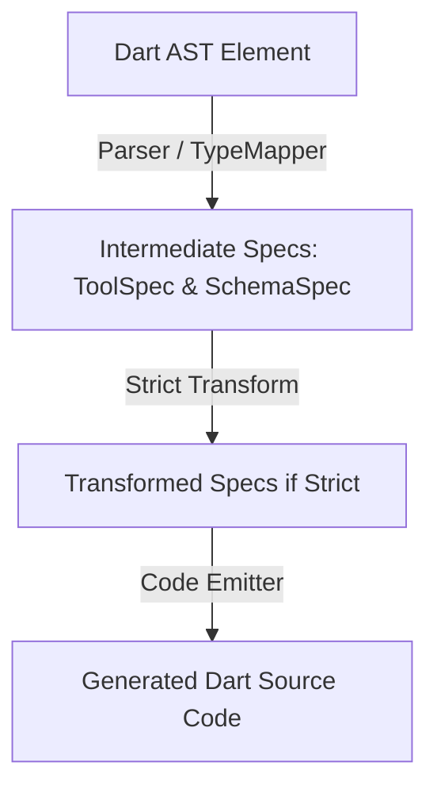

# Next-Phase Architecture Report & Refactor Proposal

## Overview

The `tool_schema_generator` package has successfully decoupled provider-specific schema shaping. Rather than generating multiple distinct schema representations at compile time, the generator emits a single, neutral JSON schema map. At runtime, [ToolDefinition](file:///home/joedev/developments/productions/tool_schema_generator/lib/src/tool_definition.dart) dynamically maps this representation to provider-specific envelopes (OpenAI, Anthropic, Gemini) using pattern matching inside its `encode()` method.

This runtime translation has major benefits:
- **Zero Schema Duplication**: Keeps the generated code size extremely small.
- **Dynamic Extensibility**: Allows users to inspect and extend schemas at runtime.
- **Performance**: High performance through static const parameters mapping and lazy runtime encoding.

Because of this runtime-driven encoding, the original phase proposal to build provider-specific encoders inside the generator is **obsolete**. However, clean decoupling of **Dart AST Parsing** from **Dart Code Generation** is still highly valuable.

---

## Architectural Refinements

The next evolution of `tool_schema_generator` should focus on separating analysis and translation from code rendering. Currently, [ToolSchemaGenerator](file:///home/joedev/developments/productions/tool_schema_generator/lib/src/tool_schema_generator.dart) traverses elements twice and directly produces string representations of schemas via [TypeMapper](file:///home/joedev/developments/productions/tool_schema_generator/lib/src/type_mapper.dart).

We propose replacing raw string-based schema generation with a structured **Schema AST (Abstract Syntax Tree)** and introducing clear **specs** to act as a compiler-style Intermediate Representation (IR).



### 1. Spec Models (IR)
Introduce compiler-neutral data structures representing the extracted metadata:
- **`ToolSpec`**: Represents the parsed definition of one tool.
  - `String name`
  - `String description`
  - `List<SchemaFormat> formats`
  - `List<ParameterSpec> parameters`
- **`ParameterSpec`**: Represents an exposed tool parameter.
  - `String name`
  - `bool isRequired`
  - `bool isNamed`
  - `bool isInjected`
  - `String? defaultValueCode`
  - `SchemaSpec schema`
- **`SchemaSpec`**: An AST representation of the parameter type schema instead of serialized Dart code strings.
  - Subclasses: `StringSchemaSpec`, `IntegerSchemaSpec`, `NumberSchemaSpec`, `BooleanSchemaSpec`, `ArraySchemaSpec`, `ObjectSchemaSpec`, `EnumSchemaSpec`.
  - Each `SchemaSpec` knows how to render itself to Dart code (e.g., via a `.toDartSource()` method).

### 2. Benefits of the Spec AST Model
- **Single-Pass Parsing**: Eliminates double-parsing of library elements.
- **Improved Testability**: Allows writing unit tests directly against the parser output (`ToolSpec`) and `SchemaSpec` transformations without doing string matching on generated code.
- **Programmatic Transformations (Strict Mode)**: Crucial for advanced schema options such as OpenAI Strict Mode.

---

## Key Feature: OpenAI Strict Mode

OpenAI supports a **Strict Mode** (`strict: true`) for tool calls, guaranteeing that the model's output will adhere exactly to the JSON Schema. This requires the parameters schema to:
1. Set `"additionalProperties": false` on all object schemas.
2. Require every defined property (including optional and nullable ones). Nullable fields must be typed as `["type", "null"]` or explicitly specify `'nullable': true`.

Doing this with the current string-based generator is complex and fragile because the schema is already serialized. With the **Schema AST Model**, this transformation becomes trivial.

### Example Transformation with `SchemaSpec`
If strict mode is enabled, we can run a recursive transformer over the `SchemaSpec`:
```dart
SchemaSpec transformToStrict(SchemaSpec spec) {
  if (spec is ObjectSchemaSpec) {
    return ObjectSchemaSpec(
      properties: spec.properties.map((k, v) => MapEntry(k, transformToStrict(v))),
      required: spec.properties.keys.toList(), // All properties must be in required
      additionalProperties: false, // Disallow additional properties
      isNullable: spec.isNullable,
    );
  }
  if (spec is ArraySchemaSpec) {
    return ArraySchemaSpec(
      items: transformToStrict(spec.items),
      isNullable: spec.isNullable,
    );
  }
  return spec;
}
```

---

## Implementation Phases

### Phase 1: Implement Schema AST (`SchemaSpec`)
Create the structured hierarchy for schemas.
- Add `SchemaSpec` and its subclasses.
- Update `TypeMapper` to return `SchemaSpec` instead of `String`.
- Write unit tests verifying that `TypeMapper` returns the correct `SchemaSpec` trees.

### Phase 2: Implement Tool Specs
Introduce the `ToolSpec` and `ParameterSpec` models.
- Create an internal parser class (`ToolParser`) that scans the `LibraryReader` and constructs a list of `ToolSpec`s.
- Move validations (duplicate tool names, invalid `@Inject` placements) into this parser.
- Write unit tests validating parsing output directly.

### Phase 3: Migrate Generator to Emitters
Update `ToolSchemaGenerator` to use the parsed `ToolSpec`s.
- Rewrite generator logic to map `ToolSpec`s to Dart source code using the specifications and `SchemaSpec.toDartSource()`.
- Ensure all existing tests in `tool_schema_generator_test.dart` remain green.

### Phase 4: OpenAI Strict Mode Support
Introduce strict mode configuration.
- Update `@Tool()` annotation to support a `strict` flag:
  ```dart
  class Tool {
    final bool strict;
    // ...
  }
  ```
- Implement the strict transformer for `SchemaSpec`.
- Update `ToolDefinition` and the generator to support emitting `strict: true` schemas.
- Add test cases checking that strict schemas have `additionalProperties: false` and all properties marked as `required`.

---

## Acceptance Criteria

- **No Public API Breakage**: The public runtime API for `ToolRegistry`, `ToolDefinition`, and existing annotations must remain backward compatible.
- **Generator Output Equivalence**: For non-strict tools, the emitted generated schemas must match the current schema formats exactly.
- **Complete Test Coverage**: Focused tests must cover the parser outputs, `SchemaSpec` representations, and strict-mode transformations.
- **Dry-run Green**: `dart analyze` and `dart pub publish --dry-run` must pass.
